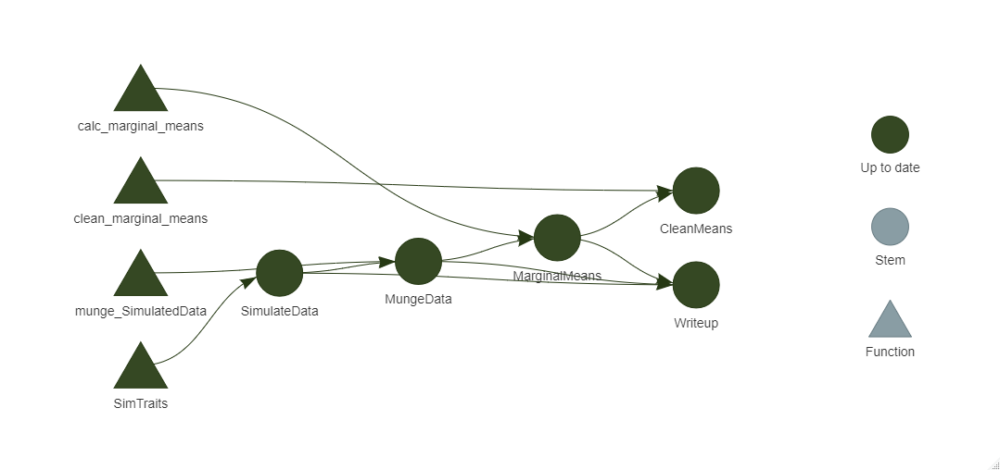

```{r setup, include=FALSE}
knitr::opts_chunk$set(echo = FALSE)
library(targets)
library(visNetwork)
## target knits Rmds in their own session, so load libraries here.
## source("here::here(packages.R"))
```

```{r load-targets, include=FALSE}
# tar_load(c(target_1, target_2, target_3))

# # If your chunk output is shown in-line, then you'll need to wrap tar_load()
# # like so:
# 
# withr::with_dir(here::here(), {
#   tar_load(c(target_1, target_2, target_3))
# })
# 
# # This is not needed when using tar_make() to render the document.

tar_load(c(SimulateData, MungeData, MarginalMeans))
WithinLoc <- MungeData$WithinLoc
AcrossLoc <- MungeData$AcrossLoc
WithinLoc_ModelData <- MarginalMeans$WithinLoc
AcrossLoc_ModelData <- MarginalMeans$AcrossLoc
```

## Introduction
Often in breeding programs, there are several experiments going on at the same time with the same general structure. In this structure, a set of genotypes is grouped in a test, and then this same test is often grown at multiple locations over multiple years. There will typically be many of these tests going on at the same time within the breeding program and while the specifics of each test might differ from one to the other, (e.g. what/how many locations they are grown in, the genotypes contained in each), the basic structure of the data produced by each is largely the same. Subsequently, the analysis of the data for any one of these tests is also pretty much the same as the rest. 

With a collection of experiments like this, the analysis can be organized in general by first defining what subsets of the data you want to apply analysis techniques to, and defining exactly what analysis tasks you want to do on each subset. What I want to do with this repository is make a collection of functions that can do both of these tasks and (hopefully) be applied to arbitrary data with this general structure. 

### Data
I made simulated data set for this analysis, here's what it looks like:
```{r SimData, echo = FALSE}
head(SimulateData)
```
In this hypothetical set of experiments, 20 genotypes (**geno**) were grown in 3 reps (**rep**) in 10 tests (**test**). These tests were then grown in 4 locations (**loc**), over three years (**year**). Five random traits were then collected for each observation (**Trait_1 - Trait_5**).

## Analysis
My goal for this analysis will be to get genotype marginal means (BLUEs) for each trait within each location, and genotype BLUPs across locations. This involves first fitting linear and mixed models for the BLUEs and BLUPs, respectively, and then using these models to obtain the BLUEs and BLUPs. The basic formulas for each of these models are: 

$$y = geno + rep$$
$$y = geno + (1|loc/rep) + (1|loc:geno) $$ 
Where *y* is the value of some phenotype. The second model uses the special mixed model specification for the random effects. The *(1|loc/rep)* term is shorthand that fits a random term for location, and the interaction of rep within location. 

The problem now is how to form groups out of the full data to apply these models to. For the location-level marginal means, I need to fit a model for each trait (5 traits), for each location (4 locations), for each test (10 tests), for each season (3 years), or a total of 5\*4\*10\*3 = 600 models. The across location marginal means require fewer models since we don't need a subset for each location, still a total of 5\*10\*3 = 150 models. To fit each of these models, we need to subset the full data according to the combinations of those four (three) factors. There's no one way to form these subsets and fit models to them, but nesting with tidyr and functional programming with purrr make for a very nice option. See [this link](https://r4ds.had.co.nz/many-models.html) for another example of this basic process that I'll apply to my own data. 

## Making subsets
I need two collections of data sets to fit my two models to. One set has to have data for each trait within each location for each test and season, and the second just needs a set for each trait (and then again for each test, and season). Forming these sets is fairly straightforward with a bit of transformation. 

```{r NestedSets, echo = TRUE, eval=FALSE}
  # Set 1: 
  WithinLocData <- SimulateData %>% 
    # Pivot so that there's a column to hold the trait names, and one to hold their value
    pivot_longer(cols = tidyselect::starts_with("Trait_"), names_to = "trait") %>%
    # Group by relevant factors and nest
    group_by(test, loc, year, trait) %>% 
    nest()
  
  # Set 2: 
  AcrossLocData <- SimulateData %>% 
    pivot_longer(cols = tidyselect::starts_with("Trait_"), names_to = "trait") %>% 
    group_by(test, year, trait) %>% 
    nest()

```

And here's what these two data sets look like
```{r NestedData, echo = FALSE}
head(WithinLoc)
head(AcrossLoc)
```

The data that I'll be fitting the models to are stored in that special **data** column. You can see there that each element in that column is actually a tibble. Here's what the first tibble looks like for the within location data.
```{r WithinLocFirst}
WithinLoc$data[[1]]
```
The **value** column is the value of the trait for this first subset, going back to the rest of the within location data, we can see that it is the value of **Trait_1**. within test A, at location 1, during year 1. The across location data has a similar structure. 

```{r AcrossLocFirst}
AcrossLoc$data[[1]]
```
The only difference here is that the loc column has been added to the nested tibble since this data set holds the all the data for a particular trait across locations for a given test grown in some year, again in this case test A and year 1.

What we have to do now is write some functions that can fit models to these data sets. 

## Model functions
We need two functions to fit the two models to be fit to the two data sets. Before nesting, you'd have to specify the actual name of the trait you want to fit a model to in the model formula, but now the value of every trait is found in the **value** column of the nested data so we can use the name of that column instead for every model. Essentially, because each subset of the data now shares a common set of column names, we can use the same model formula to analyse every subset. Here's what my functions look like.  

```{r ModelForms, echo = TRUE}
  # A function to fit a linear model to data within a year.
  # This function and the one after have (very lazy) error catching that just return
  # NA if the model fit fails
  LM_within_loc <- function(LocData){
    
    # Variables to convert to a factor
    factvars <- c("test", 
                  "loc", 
                  "geno", 
                  "year", 
                  "rep")
    
    # Convert the variables to a factor
    FactorData <- LocData %>% 
      mutate(across(any_of(factvars), ~ factor(.x)))
    
    # Fit a linear model to this data
    res <- tryCatch({
      lm(value ~ geno + rep, data = FactorData)
    }, error = function(e){
      return(NA)
    })
    return(res)
  }
  
  # A function to fit a mixed model across locations for a test
  Lmer_by_year <- function(TestData){
    
    # Variables to convert to a factor
    factvars <- c("test", 
                  "loc", 
                  "geno", 
                  "year", 
                  "rep")
    
    FactorData <- TestData %>% 
      mutate(across(any_of(factvars), ~ factor(.x)))
    
    res <- tryCatch({
      lmer(value ~ geno + (1|loc/rep) + (1|loc:geno), data = FactorData)
    }, error = function(e){
      return(NA)
    })
    return(res)
  }
```

The marginal means can also be extracted right from the fit models using the **emmeans** package. Here's a function to do that. 

```{r MarMeans, echo = TRUE}
  # A function to get a tibble of marginal means from a fit model
  get_marginal_means <- function(model){
    emmeans(model, "geno") %>%
      as_tibble()
  }
```
All that's left is to fit these models and extract the marginal means from each set of nested data. This can be done easily with mapping functions from [purrr](https://purrr.tidyverse.org/). The *map* function takes a list of objects and a function and then applies that function to each list element and gives you the result. As an example...

```{r mapexample, echo = TRUE}
# Take the first five data elements from the within location data
WithinLoc_firstfive <- WithinLoc$data[1:5]

# Fit linear models to these first five data sets
models_firstfive <- map(WithinLoc_firstfive, LM_within_loc)

# And get marginal means from each model
emmeans_firstfive <- map(models_firstfive, get_marginal_means)

# Combine the results in a tibble
results <- tibble(data   = WithinLoc_firstfive, 
                  models = models_firstfive, 
                  marginal_means = emmeans_firstfive)

results
```

You can see that the models column has a list of lm objects, and the marginal means holds a list of tibbles which hold the genotype marginal means. 

These map functions can be used directly within the dplyr mutate verb to add these results directly to the original data sets
```{r mutateModels, eval = FALSE, echo = TRUE}
  WithinLoc_ModelData <- WithinLoc %>% 
    mutate(model          = map(data, LM_within_loc), 
           marginal_means = map(model, get_marginal_means))
  
  AcrossLoc_ModelData <- AcrossLoc %>% 
    mutate(model          = map(data, Lmer_by_year), 
           marginal_means = map(model, get_marginal_means))

```

```{r modelData, echo = TRUE}
WithinLoc_ModelData
AcrossLoc_ModelData
```

Applying the functions this way means that you can store the data used for the analysis, the statistical models used to perform the analysis, and the results of the analysis all in the same data object. 

Tidying up the results is also very easy, the column holding the marginal means can be unnested and the data pivoted to get the final results. 

```{r unnested_model, echo = TRUE}
Unnested_WithinLoc <- WithinLoc_ModelData %>% 
  select(test, loc, year, trait, marginal_means) %>% 
  unnest(marginal_means)

Unnested_WithinLoc

Unnested_WithinLoc %>% 
  select(test, loc, year, trait, geno, emmean) %>% 
  pivot_wider(names_from = trait, values_from = emmean) %>% 
  arrange(test, year, geno, loc)
```

The across location data can be cleaned up similarly.
```{r unnested_acrossLoc, echo = TRUE}
AcrossLoc_ModelData %>% 
  select(test, year, trait, marginal_means) %>% 
  unnest(marginal_means) %>% 
  select(test, year, trait, geno, emmean) %>% 
  pivot_wider(names_from = trait, values_from = emmean) %>% 
  arrange(test, year, geno)
```

## Concluding remarks
In total, I have only had to use three functions to analyze hundreds of experiments. By using nested dataframes, the entire analysis workflow can be kept very organized by storing everything within the same object. Using functions from the tidyverse allows for the whole analysis to be performed with a compact but descriptive pipeline of function calls.

This function-oriented approach allows for the overall workflow to be quickly adapted to new datasets. By defining the general structure, you only have to adjust the parts that are unique to your own data (e.g. the trait names). The whole process can be further automated by using the [targets](https://github.com/ropensci/targets) workflow management package. I've used this package to automate the steps described here and the workflow can be seen in this repository.




## Reproducibility

<details><summary>Reproducibility receipt</summary>

```{r}
## datetime
Sys.time()

## repository
if(requireNamespace('git2r', quietly = TRUE)) {
  git2r::repository()
} else {
  c(
    system2("git", args = c("log", "--name-status", "-1"), stdout = TRUE),
    system2("git", args = c("remote", "-v"), stdout = TRUE)
  )
}

## session info
sessionInfo()
```

</details>
